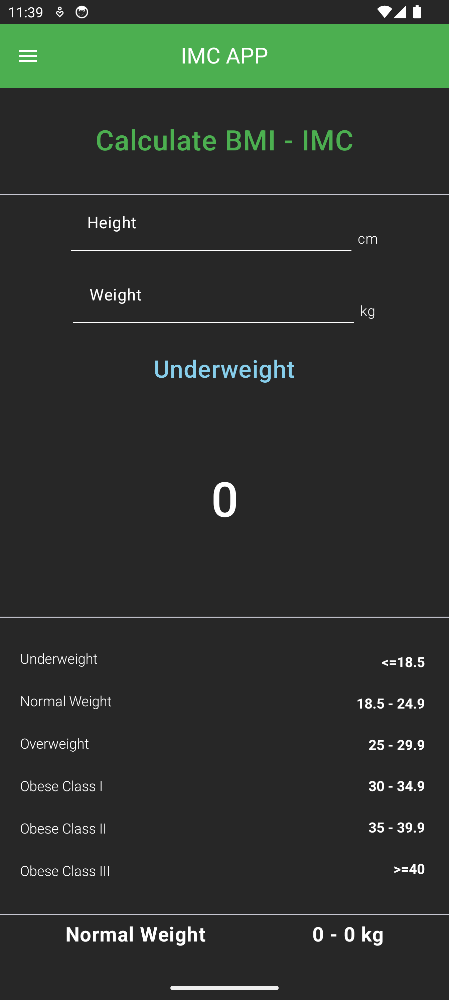
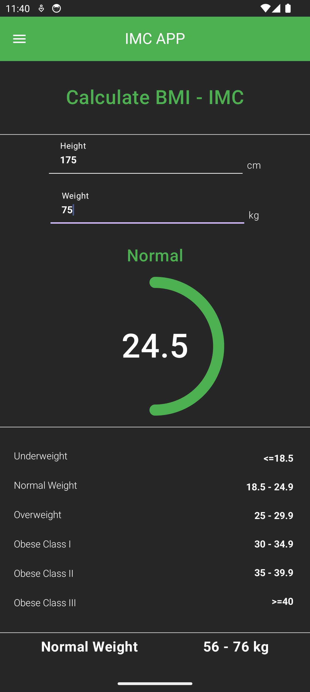
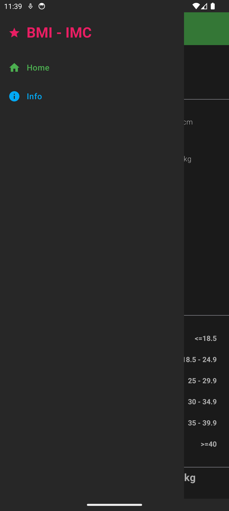
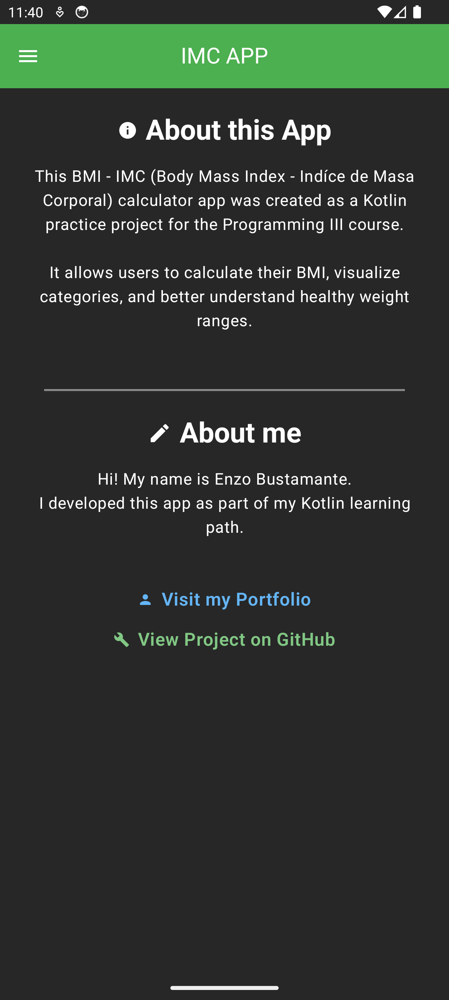

# 🎨 MCI - BMI App

An **Android Jetpack Compose** app for calculating **Body Mass Index (BMI)**.
The app features a **custom TopAppBar with a centered title**, a **modern navigation drawer**, and a **vibrant design** that makes the UI feel like a digital painting.

---

## ✨ Features

* 📱 Built with Jetpack Compose (modern declarative UI)
* 🎨 Custom TopAppBar with centered title and icons
* 🖼️ Modal Navigation Drawer with Picasso-style colors and layout
* 🧮 Instant BMI calculation with results displayed immediately
* ⚡ Simple navigation powered by Navigation-Compose
* 🌙 Custom theme and colors for a bold artistic look

---

## 📂 Project Structure

Since this is a default project setup, the structure is very simple:

```
app/
 ├── ui/        # Themes, components, and screens
 └── MainActivity.kt   # Entry point
```

---

## 🚀 Getting Started

### Prerequisites

* Android Studio Flamingo or newer
* Kotlin 1.8+
* Basic knowledge of Jetpack Compose

### Installation

1. Clone this repository:

   ```
   git clone https://github.com/Enzo889/IMCAPP.git
   cd IMCAPP
   ```

2. Open the project in Android Studio.

3. Sync Gradle dependencies.

4. Run the app on an emulator or a physical Android device.

---

## 🔮 Roadmap

* 🌐 Multi-language support
* 🗂️ Save BMI calculation history
* ☁️ Cloud sync for user profiles

---

## 📸 Screenshots






---

## 🛠️ Built With

* Kotlin
* Jetpack Compose
* Material 3
* Navigation-Compose

---

## 👨‍🎨 Author

Developed by **Enzo Bustamante**


